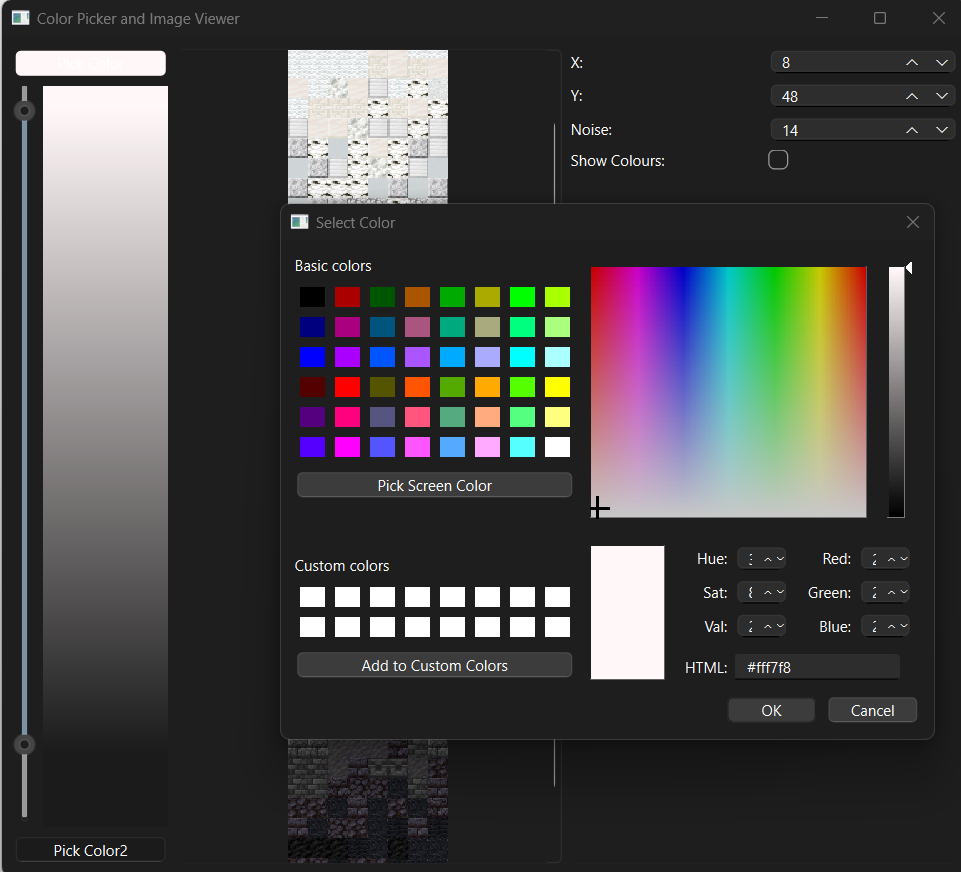
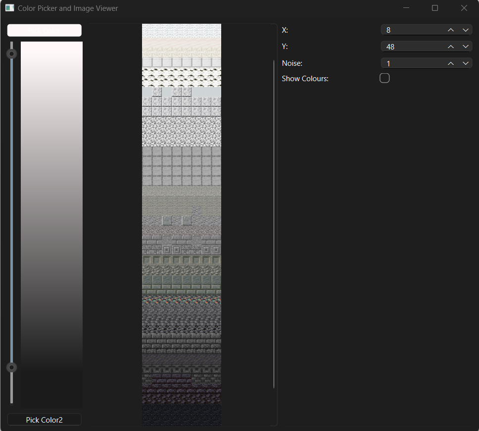
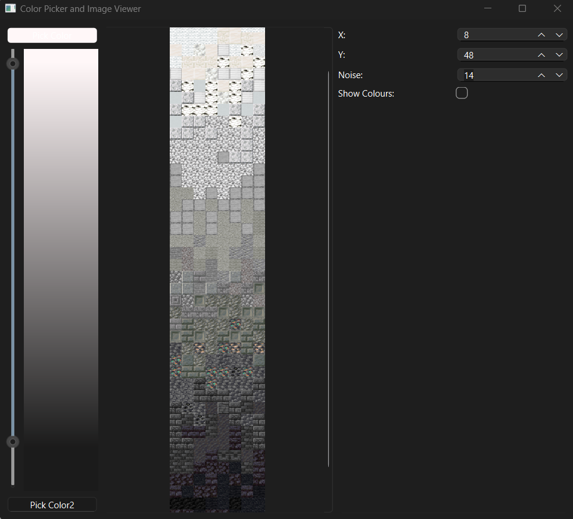
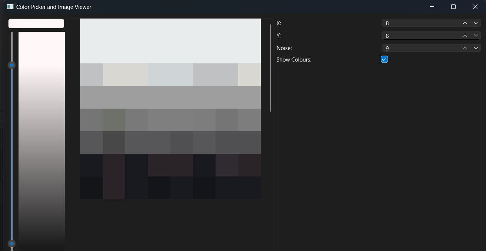

# Pixel Gradient Mapper
Maps a palette of images to a 2D gradient. Uses the average colour of an image 
to match the closet point on the gradient.

### Sessions
The current session is stored in the registry, all settings will be retrieved 
when loading up the app. Noise is seeded so it will persist sessions.

### Filters
Click any image in the graph to add it the filter, you can return it from the filter section on
the bottom right at any time.

### Range Sliders
On the left you have a two point levels to adjust the tightness of the gradient.

### Colour Picker
You can pick the colours for the start and end points for the gradient.
This has realtime feedback.

### Noise
You can introduce some noise to break up the gradient 

|              Low Noise              |              High Noise              |
|:-----------------------------------:|:------------------------------------:|
|  |  |

### Colour Palette
You can show the average colour of the sample palette texture.

### Dimensions
You have a very large canvas, Changes at large dimensions will take longer.

### How to run
set up your venv, run `python pip install -r requirements.txt` in the root of the project
`python gradient_mapper/main.py`

### Tips
Try not use 100% of a colour value like (255,255,255) or (255,0,0) as this can 
limit the amount of matched closet colours, and when adding noise on top.

